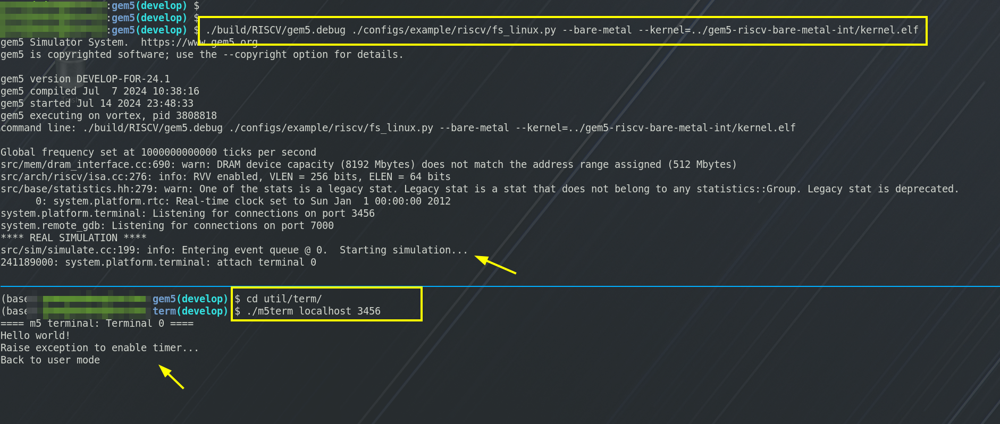

# RISCV Bare Metal
A RISC-V bare-metal example with uart, exception, interrupt and kvmmap.

The tutorial is at [https://mullerlee.cyou/2020/07/09/riscv-exception-interrupt/](https://mullerlee.cyou/2020/07/09/riscv-exception-interrupt/)

## Requirement

- qemu
- riscv64-linux-gnu-*
- gem5

## Run on qemu

```bash
mkdir build
make
make run
```

## Debug
```bash
mkdir build
make
make debug
riscv64-linux-gnu-gdb -x debug.txt
```

## Run on gem5

### dir structure

```bahs
├── gem5
│   └── build
│       └── gem5.opt
└── gem5-riscv-bare-metal-int
    └── kernel.elf
```

### build testcase

NOTE: set RISCV to riscvtoolchain

```bash
$ cd gem5-riscv-bare-metal-int

$ make

$ ls -l build/
```

### gem5

```bash
$ cd gem5
$ scons -sQ -j$(nproc) build/RISCV/gem5.debug

$ ./build/RISCV/gem5.debug ./configs/example/riscv/fs_linux.py --bare-metal --kernel=../gem5-riscv-bare-metal-int/kernel.elf

# new ternimal/shell
$ cd util/term

$ make

$ ./m5term localhost 3456
```


